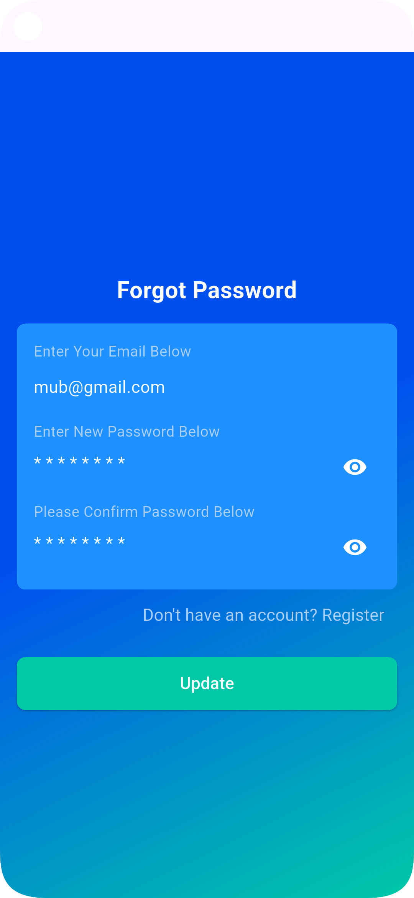
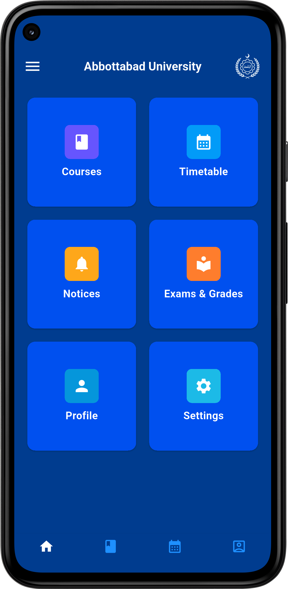
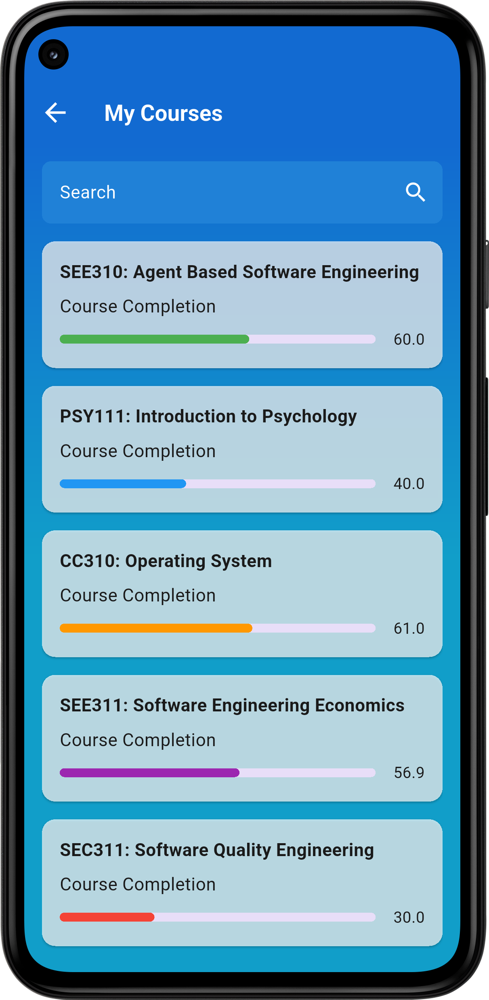
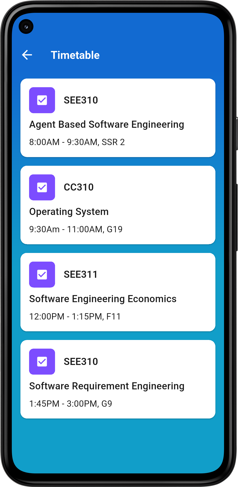
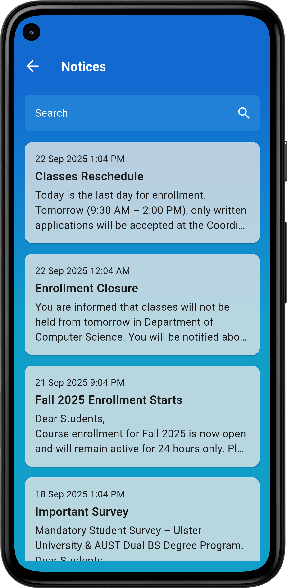
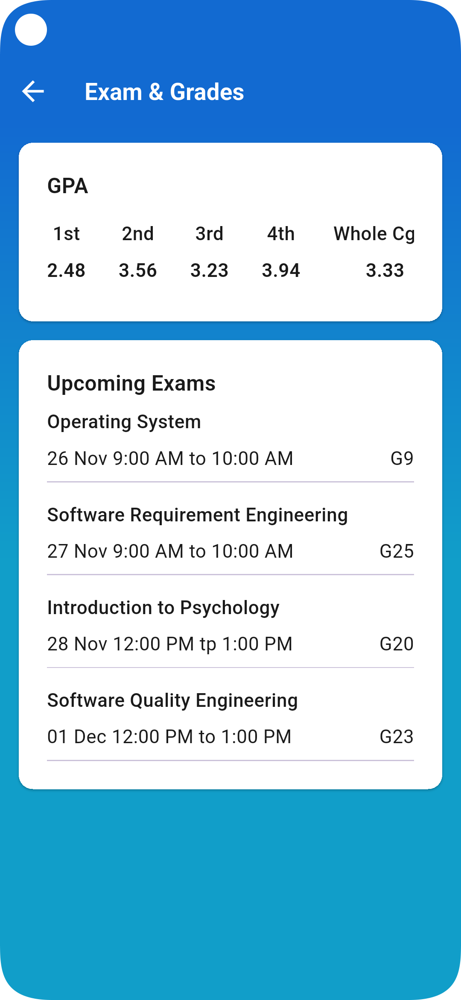
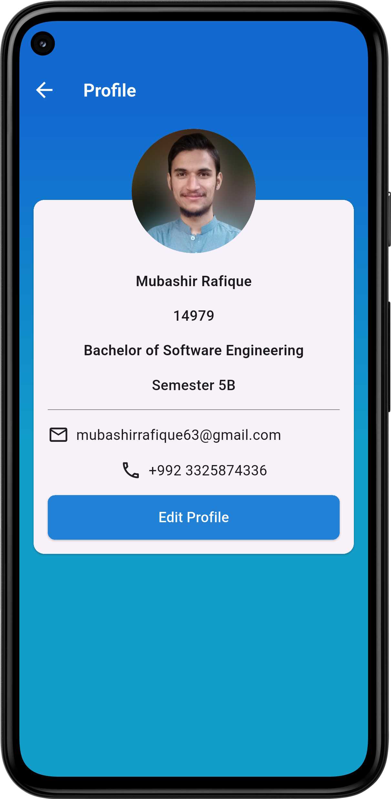
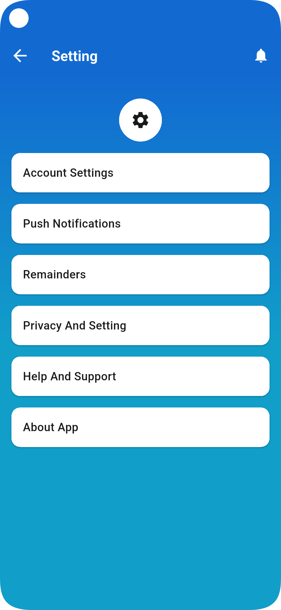
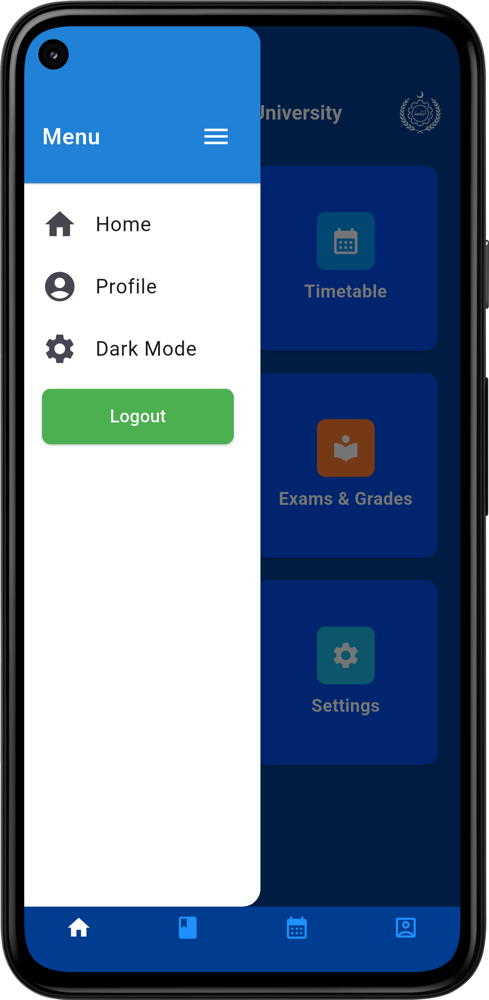

# Aust-Campus-App
A simple and responsive university app UI built with Flutter. Features a splash screen, drawer navigation, dashboard items, profile section, and reusable components. Developed as a learning project to explore Flutter development, practice UI design, and implement clean architecture principles.

# Login Screen 

A clean sign-in screen where users enter their roll number and password. Includes password visibility toggle, forgot password navigation, and a gradient background.

# Register Screen

Screen for new users to create an account. Enter CNIC, Email, Roll Number, and Password. Tap Register to proceed to the dashboard or Login if you already have an account.

### Forgot Password Screen
 
 
Allows users to reset their password by entering their email, new password, and confirming it. Tap Update to save changes and return to the login screen. Option to navigate to Register if the user doesn’t have an account.

### Dashboard Screen 

Main app screen displaying key sections like Courses, Timetable, Notices, Exams & Grades, Profile, and Settings. Tap any card to navigate to the respective section. Includes a navigation drawer and app bar for quick access.

### Course Screen
 
Displays a list of courses with completion percentages and progress bars. Includes a search field to quickly find courses. Each card shows the course title, completion status, and color-coded progress indicator.

### Timetable Screen
 
Shows the weekly timetable with course codes, titles, and class timings. Each entry is displayed in a card with a clear layout for easy reference.

### Notice Screen
  

Displays university notices with title, date, and a short description. Includes a search field to quickly find important updates and announcements.

### Exam & Grades Screen
 
Shows GPA for each semester and a list of upcoming exams with subject, date, and venue. Helps students track academic performance and exam schedule in one place.

### Profile Screen

Displays user information including name, roll number, program, semester, email, and phone number. Users can view their profile picture and tap **Edit Profile** (currently non-functional) to update details.

### Settings Screen

Lists app settings including account, notifications, reminders, privacy, help, and about sections. Each item is displayed in a clean card layout for easy navigation.

### App Drawer

Provides quick navigation to Home, Profile, and Settings. Includes a logout button and uses a clean header design for easy access to app sections.

