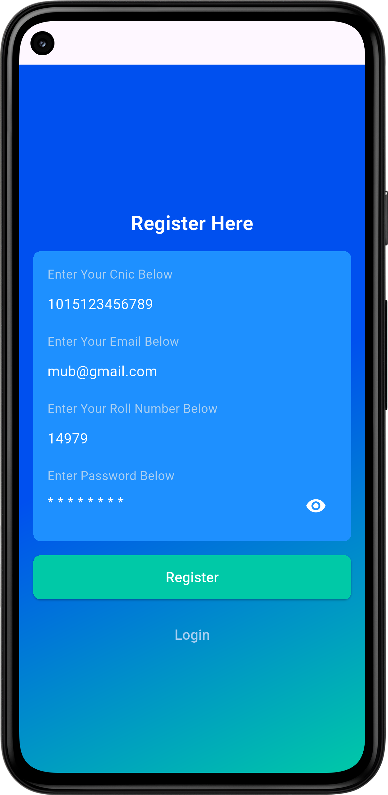

# Aust-Campus-App

A simple and responsive university app UI built with Flutter. Features a splash screen, drawer navigation, dashboard items, profile section, and reusable components. Developed as a learning project to explore Flutter development, practice UI design, and implement clean architecture principles.

# Login Screen 
A clean sign-in screen where users enter their roll number and password. Includes password visibility toggle, forgot password navigation, and a gradient background.

# Register Screen 
Screen for new users to create an account. Enter CNIC, Email, Roll Number, and Password. Tap **Register** to proceed to the dashboard or **Login** if you already have an account.

# Register Screen 
Screen for new users to create an account. Enter CNIC, Email, Roll Number, and Password. Tap **Register** to proceed to the dashboard or **Login** if you already have an account.

